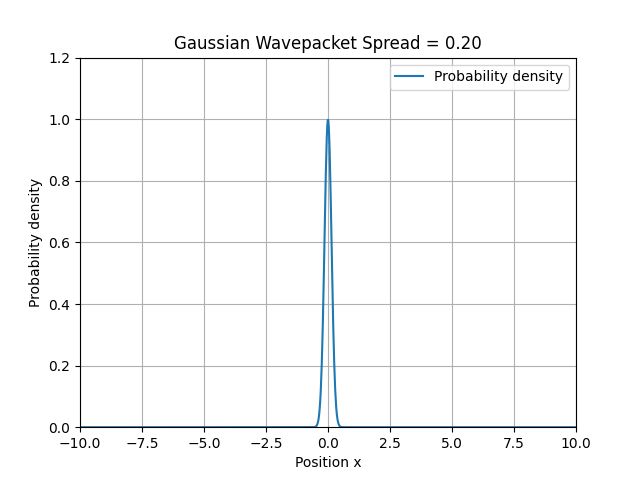
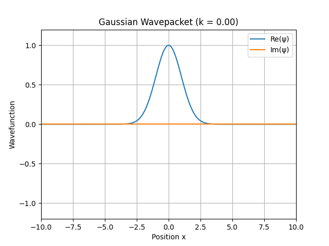

## Overview

Quantum Visualizer is a Python-based scientific computing project for exploring introductory quantum mechanics through numerical computation and visualization.

The project models wavefunctions, probability densities, expectation values, uncertainty, and complex Gaussian wavepackets. It also includes visualizations and animations that help make abstract quantum concepts more intuitive.

## Goals

* Visualize wavefunctions and probability densities
* Explore quantum systems through computation
* Build intuition for abstract quantum concepts
* Practice scientific computing with Python, NumPy, and Matplotlib

## Technologies

* Python
* NumPy
* Matplotlib
* Pytest

## Status

Currently in development.

Planned topics include:

* Wavefunction normalization
* Particle-in-a-box states
* Gaussian wave packets
* Quantum tunneling
* Additional visualizations that help make quantum mechanics more enjoyable

## Example Visualizations

### Gaussian Wavepacket Spread Animation

### Gaussian Wave Number Animation

### Uncertainty Product vs Spread

